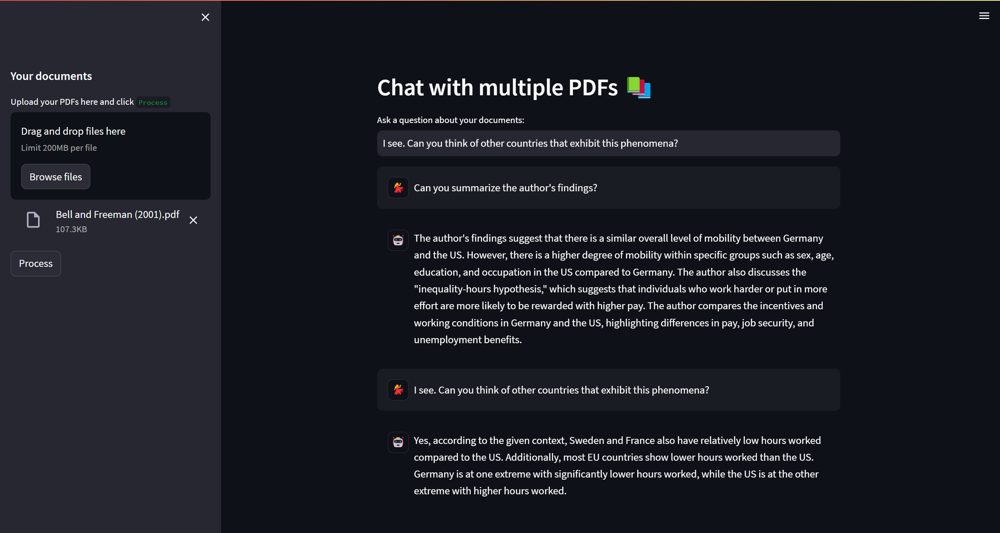

### **TLDR**

Simple PDF chatbot using LangChain, OpenAI and FAISS vector store.

### **Sample User Interface**

### **Resources**

- Credit goes to Alejandro AO's [tutorial](https://www.youtube.com/watch?v=dXxQ0LR-3Hg) on using LangChain, OpenAI's API and FAISS vector store. 